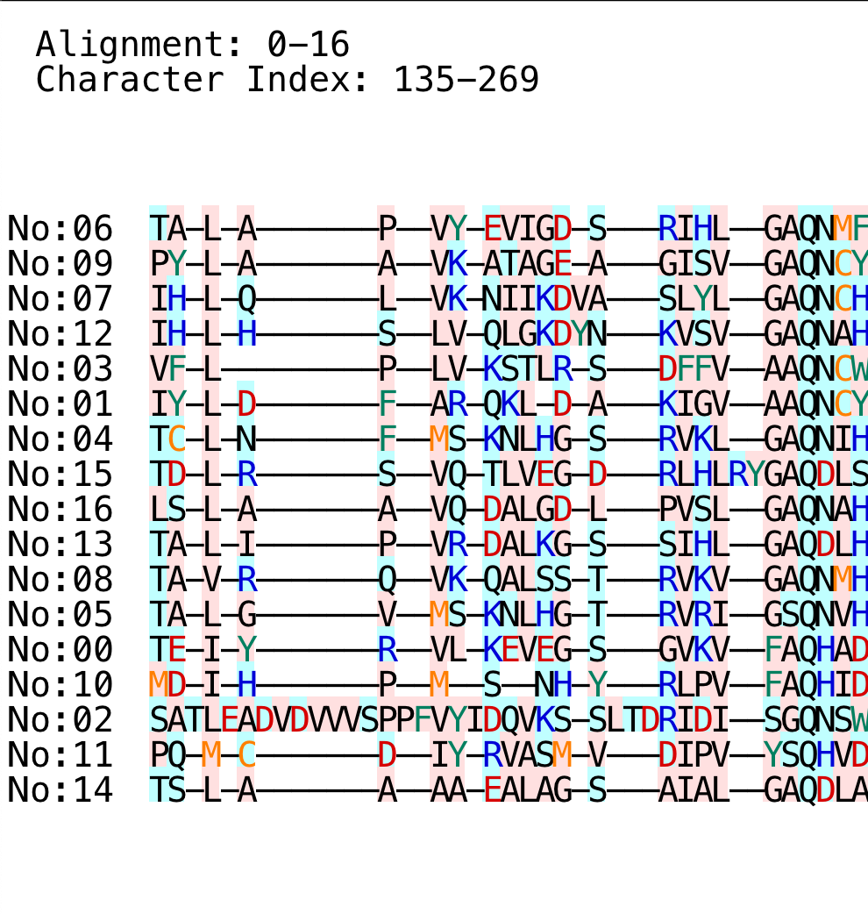

# BioInfo

アミノ酸のアライメントをスター法を用いて計算する。

計算結果はGUIで表示され、WASDで見たい箇所を選ぶことができる。

実行結果

## 特徴

アミノ酸の性質ごとに色分けがされており、

- 背景色の違いによって(親水性アミノ酸、疎水性アミノ酸)を分けている
- 赤文字は酸性アミノ酸、青は塩基性、緑は芳香環をもつアミノ酸、橙は中性アミノ酸

となっている

## 環境

Java13で開発しているので動作にはJavaが必要。

## License
MIT